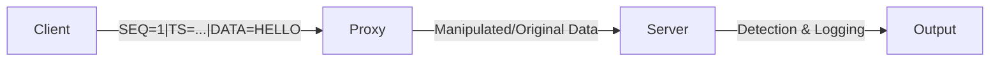

# MITM Detection System

A containerized simulation of Man-In-The-Middle (MITM) attacks and their detection mechanisms. This project demonstrates how sequence numbers, timestamps, and integrity checks can be used to identify common network-based attacks.

## 🏗️ Architecture

The system consists of three main components running in isolated Docker containers:

1.  **Client**: Generates and sends structured messages to the server via the proxy.
2.  **Proxy (Attacker)**: Intercepts traffic between the client and server. It can be configured to operate in different "attack modes" (transparent, modify, replay, delay).
3.  **Server**: Receives messages and applies detection rules to identify potential MITM interference.



## 🛡️ Detection Mechanisms

The server implements several security checks to detect anomalies:

*   **Replay & Reordering Detection**: Uses sequence numbers (`SEQ`) to ensure messages are received in the correct order and are not duplicates of previous transmissions.
*   **Delay Detection**: Compares the message timestamp (`TS`) with the server's current time. If the latency exceeds a threshold (default 2s), a delay attack is flagged.
*   **Integrity Checks**: Validates the message format. If the proxy modifies the structure or content in an unexpected way, an integrity violation alert is triggered.

## 😈 MITM Attack Modes

The proxy's behavior is controlled by the `MODE` environment variable:

| Mode | Description |
| :--- | :--- |
| `transparent` | Forwards data without modification (Normal operation). |
| `modify` | Alters the payload (e.g., changes "HELLO" to "HACKED"). |
| `replay` | Sends the previous message instead of the current one. |
| `delay` | Introduces a 3-second lag before forwarding the message. |

## 🚀 Getting Started

### Prerequisites

*   [Docker](https://www.docker.com/get-started)
*   [Docker Compose](https://docs.docker.com/compose/install/)

### Installation & Running

1.  **Clone the repository**:
    ```bash
    git clone https://github.com/your-username/MITM_Detection_System.git
    cd MITM_Detection_System
    ```

2.  **Start the simulation**:
    ```bash
    docker-compose up --build
    ```

3.  **Observe the logs**:
    You will see the interaction between the client, proxy, and server. The server will output `[ALERT]` messages when it detects an attack.

### Configuration

To test different attack scenarios, modify the `MODE` variable in the `docker-compose.yml` file:

```yaml
proxy:
  environment:
    - MODE=modify # Options: transparent, modify, replay, delay
```

## 📂 Project Structure

```text
.
├── client/
│   ├── client.py      # Message generator
│   └── Dockerfile
├── proxy/
│   ├── proxy.py       # MITM simulation logic
│   └── Dockerfile
├── server/
│   ├── server.py      # Detection engine
│   └── Dockerfile
└── docker-compose.yml # Orchestration
```

## 📝 License

This project is for educational purposes only.
